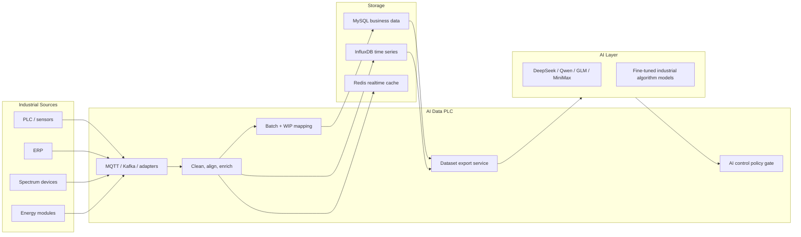
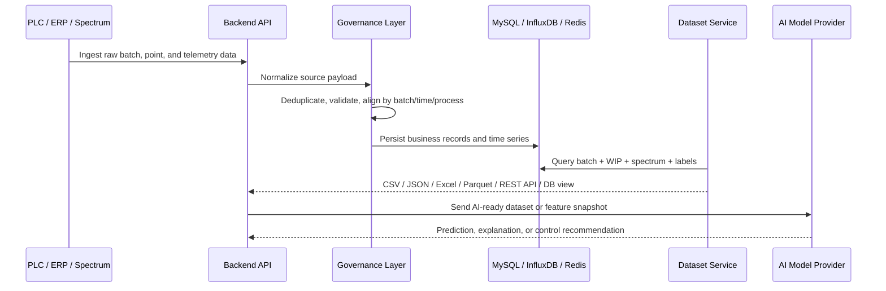
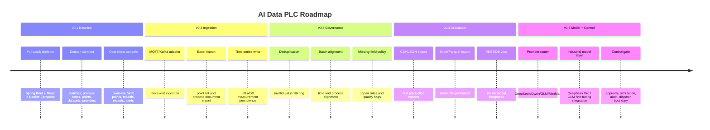

<h1 align="center">AI Data PLC</h1>

<p align="center">
  <strong>面向纺织染整 AI 的工业数据中间平台</strong><br/>
  Industrial Data Middleware for Textile Dyeing AI
</p>

<p align="center">
  
  
  
  
  
  
  
  
</p>

<p align="center">
  <a href="#zh"><strong>中文</strong></a>
  |
  <a href="#en"><strong>English</strong></a>
</p>

<p align="center">
  <a href="https://ai-data-plc-frontend.onrender.com"><strong>Live Demo</strong></a>
  |
  <a href="https://ai-data-plc-backend.onrender.com/actuator/health">API Health</a>
  |
  <a href="https://ai-data-plc-backend.onrender.com/api/v1/overview">Overview API</a>
</p>

---

<a id="zh"></a>

## 中文说明

### 概览

AI Data PLC 是一个面向纺织染整场景的工业数据中间平台。平台位于 PLC、ERP、光谱仪、能源模块等工业数据源与 AI 算法层之间，负责完成数据采集、清洗、批次对齐、工艺/WIP 映射、时序与业务数据存储、标准数据集导出，以及 AI 控制建议的安全闸门。

当前版本围绕染缸生产批次建模，一个生产批次以统一的 `batch_id` 贯穿生产批次、工序流转、采集测点、光谱结果、AI 标签和数据集导出。

### 在线演示

| 环境 | 地址 |
| --- | --- |
| 前端控制台 | https://ai-data-plc-frontend.onrender.com |
| 后端 API | https://ai-data-plc-backend.onrender.com |
| 后端健康检查 | https://ai-data-plc-backend.onrender.com/actuator/health |
| Overview API | https://ai-data-plc-backend.onrender.com/api/v1/overview |

### 核心能力

- **多源数据接入** - 支持 PLC、ERP、光谱设备、能源模块，并预留协议适配扩展。
- **双协议路线** - 优先支持 MQTT/Kafka 标准采集链路，同时保留 OPC UA、Modbus、S7、厂商私有协议等 PLC 直连方案。
- **批次中心模型** - 以 `batch_id` 串联批次、工序、测点、时序数据、光谱数据和数据集任务。
- **工艺/WIP 映射** - 覆盖开卡、配缸、冷堆、染色、还原清洗、皂洗、定型、烘干、成品打卷等染整流程节点。
- **数据治理** - 支持去重、异常值过滤、缺失字段修复钩子、批次/时间/工序对齐和质量标记。
- **分层存储** - MySQL 存业务主数据，InfluxDB 存高频时序数据，Redis 存实时状态和运行缓存。
- **AI 数据集导出** - 面向 CSV、JSON、Excel、Parquet、REST API、数据库视图等训练和集成格式。
- **模型供应商管理** - DeepSeek Pro、Qwen、GLM、MiniMax 和 OpenAI-compatible 网关通过环境变量和后台合约配置。
- **工业算法层** - 支持后续接入 DeepSeek Pro / GLM 微调或专用工业模型，用于染色结果预测、工艺优化和控制建议。
- **AI 控制安全闸门** - 支持关闭、仅建议、仿真、人工审批、自动下发等控制模式。
- **运营管理台** - React 前端覆盖总览、采集监控、批次追踪、工艺流程、测点配置、模型管理、数据集导出和告警中心。
- **可部署交付** - 本地使用 Docker Compose，云端提供 Render 部署配置。

### 快速开始

复制环境模板，按需填写密钥，然后启动本地完整栈：

```bash
cp .env.example .env
docker compose up --build
```

| 服务 | 地址 |
| --- | --- |
| 前端控制台 | http://localhost:5173 |
| 后端 API | http://localhost:8080 |
| 后端健康检查 | http://localhost:8080/actuator/health |
| MySQL | localhost:3306 |
| InfluxDB | http://localhost:8086 |
| Redis | localhost:6379 |

### 环境要求

- Docker Desktop，需支持 Docker Compose。
- Node.js 22+，用于前端单独开发。
- Java 21 和 Maven 为可选项，后端默认可在 Docker 构建阶段完成编译。

### 本地开发

完整栈：

```bash
docker compose up --build
```

仅启动前端：

```bash
cd frontend
npm install
npm run dev
```

构建后端镜像：

```bash
docker build -t ai-data-plc-backend:dev ./backend
```

构建前端镜像：

```bash
docker build -t ai-data-plc-frontend:dev ./frontend
```

### 架构与项目结构

```text
AI_Data_PLC/
|-- backend/                  # Spring Boot 3.3 + Java 21 API 服务
|   |-- src/main/java/com/supergokou/aidataplc/
|   |   |-- config/           # 运行配置、CORS、模型供应商配置
|   |   |-- controller/       # /api/v1 REST 控制器
|   |   |-- domain/           # 平台领域记录和枚举
|   |   |-- dto/              # 请求/响应 DTO
|   |   `-- service/          # 数据集、模型供应商、样例数据服务
|   |-- src/main/resources/   # Spring 配置
|   `-- Dockerfile
|-- frontend/                 # React 18 + Vite 8 运营控制台
|   |-- src/
|   |   |-- App.tsx           # 控制台页面和交互
|   |   |-- main.tsx
|   |   `-- styles.css
|   `-- Dockerfile
|-- deploy/
|   `-- mysql/init/           # 本地 Compose 的 MySQL 初始化脚本
|-- docs/
|   |-- architecture.md       # 系统架构说明
|   |-- data-mapping.md       # Excel 数据样例到领域模型的映射
|   |-- deployment.md         # 本地和 Render 部署说明
|   `-- multi-agent-plan.md   # 多 agent 执行计划
|-- docker-compose.yml        # MySQL + InfluxDB + Redis + backend + frontend
|-- render.yaml               # Render Blueprint 配置
`-- .env.example              # 公开环境变量模板，不含真实密钥
```

### 系统设计

```text
PLC / ERP / spectrum / energy data
        -> AI Data PLC
        -> cleaning, alignment, WIP mapping, storage, export
        -> standardized datasets
        -> AI training, simulation, process analysis, and control recommendations
```



### 数据集链路



### AI 控制安全闸门

| 模式 | 行为 |
| --- | --- |
| `OFF` | 关闭所有 AI 控制行为 |
| `RECOMMEND_ONLY` | 只保存建议，不面向设备下发动作 |
| `SIMULATION` | 只运行仿真或 dry-run 决策 |
| `APPROVAL_REQUIRED` | 人工审批后才允许进入下发流程 |
| `AUTO_DISPATCH` | 通过全部安全检查后才允许下发白名单动作 |

默认模式为 `RECOMMEND_ONLY`。

### API 接口

| Method | Path | 说明 |
| --- | --- | --- |
| `GET` | `/actuator/health` | Spring Boot 健康检查 |
| `GET` | `/api/v1/overview` | 运营总览指标 |
| `GET` | `/api/v1/batches` | 当前样例生产批次 |
| `GET` | `/api/v1/process-steps` | 工艺/WIP 映射 |
| `GET` | `/api/v1/points` | AI 数据采集测点定义 |
| `GET` | `/api/v1/models/providers` | 模型供应商配置状态，不暴露 API Key |
| `GET` | `/api/v1/models/control-policy` | 当前 AI 控制模式和安全策略 |
| `GET` | `/api/v1/datasets/formats` | 支持的数据集导出格式 |
| `POST` | `/api/v1/datasets/exports` | 创建数据集导出任务 |

数据集导出请求示例：

```json
{
  "batchIds": ["B20260324001", "B20260324002"],
  "format": "CSV",
  "includeSpectrum": true,
  "includeWipEvents": true,
  "includeAiLabels": true
}
```

### 数据模型

本地初始化 schema 位于 `deploy/mysql/init/001_initial_schema.sql`。

| 表 | 用途 |
| --- | --- |
| `production_batch` | 以 `batch_id` 为核心的生产批次主数据 |
| `process_step` | 标准工艺路线和工序/WIP 定义 |
| `batch_wip_event` | 批次在各工序之间的流转记录 |
| `point_definition` | 来自项目测点清单的采集点目录 |
| `spectrum_result` | K/S、反射率、Delta E 2000、Lab 值和光谱 JSON |
| `dataset_export_job` | 异步数据集导出生命周期 |
| `model_provider_config` | 模型供应商元数据和密钥引用 |
| `ai_decision_log` | 模型建议、审批、下发和审计记录 |

### 支持的数据集格式

| 格式 | 使用场景 |
| --- | --- |
| CSV | 离线模型训练和表格检查 |
| JSON | API 集成和嵌套 WIP/光谱数据 |
| Excel | 业务复核和人工数据交换 |
| Parquet | 大规模训练和分析管线 |
| REST API | 在线 AI 服务调用 |
| DB view | BI、分析和受控内部数据访问 |

### 模型供应商

| Provider | 角色 |
| --- | --- |
| DeepSeek Pro | 工业算法层、推理、预测支持 |
| GLM | 工业算法层、微调或模型服务后端 |
| Qwen | LLM 分析、报告和可选算法供应商 |
| MiniMax | LLM 分析、报告和操作员辅助 |
| OpenAI-compatible | 兼容网关、本地模型服务、vLLM 或未来供应商 |

模型密钥从环境变量读取。后端只暴露配置状态和模型名称，不暴露原始 API Key。

### 配置

关键环境变量已记录在 `.env.example`。

```env
PLC_REALTIME_DELAY_SECONDS=5
AI_CONTROL_MODE=RECOMMEND_ONLY

DEEPSEEK_API_KEY=
QWEN_API_KEY=
GLM_API_KEY=
MINIMAX_API_KEY=
OPENAI_COMPATIBLE_API_KEY=

AI_CONTROL_WRITE_ENABLED=false
AI_CONTROL_DRY_RUN=true
AI_CONTROL_REQUIRE_HUMAN_APPROVAL=true
AI_CONTROL_ALLOWED_ACTIONS=READ_STATUS,SUGGEST_SETPOINT
AI_CONTROL_BLOCKED_ACTIONS=PLC_WRITE,PUMP_START,VALVE_OPEN,RESET_ESTOP
```

不要提交真实 `.env` 文件。

### 部署

本地或测试环境：

```bash
docker compose up -d --build
```

Render 部署：

- 仓库包含 `render.yaml`，可作为 Render Blueprint 配置。
- 前端 `VITE_API_BASE_URL` 必须指向后端公网 URL。
- 后端 `CORS_ALLOWED_ORIGINS` 必须包含前端公网 URL。
- 真实 API Key 和数据库密码应配置为 Render 环境变量或 secrets。
- 生产 MySQL、InfluxDB 和 Redis 可接入外部托管服务。

### 质量检查

当前基线已通过：

```bash
npm run build
npm audit --registry=https://registry.npmjs.org
docker build -t ai-data-plc-backend:dev ./backend
docker build -t ai-data-plc-frontend:dev ./frontend
docker compose up -d --build
```

期望健康检查：

```json
{
  "status": "UP"
}
```

### 当前限制

- MQTT/Kafka 和 PLC 直连协议适配器已规划，尚未实现。
- MySQL schema 当前为初始化脚本，生产迁移建议迁到 Flyway 或 Liquibase。
- 数据集导出任务当前已提供合约和队列响应，完整文件生成后续实现。
- UI 当前是第一版运营控制台基线，使用后端样例数据。
- AI provider 调用和微调任务编排尚未接入外部 API。

### 路线图



### 文档

- [Architecture](docs/architecture.md)
- [Data Mapping](docs/data-mapping.md)
- [Deployment](docs/deployment.md)
- [Multi-Agent Plan](docs/multi-agent-plan.md)

### 贡献

1. 创建 feature branch。
2. 不要把真实密钥提交到仓库。
3. 为后端合约和前端工作流补充或更新测试。
4. 提交 PR 前运行本地构建检查。
5. 如果 schema 或环境变量发生变化，同步更新 `docs/`。

[Back to top](#ai-data-plc) | [English](#en)

---

<a id="en"></a>

## English Version

### Overview

AI Data PLC is an industrial data middleware platform for textile dyeing production. It sits between industrial sources such as PLCs, ERP, spectrum devices, and energy modules, and the AI algorithm layer. It handles data collection, cleaning, batch alignment, process and WIP mapping, time-series and business storage, standardized dataset export, and the safety gate for AI control recommendations.

The current implementation is centered on dyeing batches. A single production run is represented by one stable `batch_id` that connects batch state, process movement, collection points, spectrum results, AI labels, and dataset export jobs.

### Live Deployment

| Environment | URL |
| --- | --- |
| Frontend console | https://ai-data-plc-frontend.onrender.com |
| Backend API | https://ai-data-plc-backend.onrender.com |
| Backend health | https://ai-data-plc-backend.onrender.com/actuator/health |
| Overview API | https://ai-data-plc-backend.onrender.com/api/v1/overview |

### Key Capabilities

- **Multi-source ingestion** - PLC, ERP, spectrum devices, energy modules, and future protocol adapters.
- **Dual protocol plan** - MQTT/Kafka standard ingestion first, with PLC direct adapters reserved for OPC UA, Modbus, S7, and customer-specific protocols.
- **Batch-centered data model** - `batch_id` anchors production batches, process steps, telemetry, spectrum results, and dataset export jobs.
- **Process/WIP mapping** - Maps textile dyeing steps such as open card, bucket assignment, cold pad-batch, dyeing, reduction cleaning, soaping, setting, drying, and finished rolling.
- **Data governance** - Deduplication, invalid-value filtering, missing-field repair hooks, batch/time/process alignment, and quality flags.
- **Layered storage** - MySQL for business data, InfluxDB for high-frequency time series, Redis for realtime state and operational cache.
- **AI-ready dataset export** - CSV, JSON, Excel, Parquet, REST API, and database-view contracts.
- **Model provider management** - DeepSeek Pro, Qwen, GLM, MiniMax, and OpenAI-compatible providers are configurable through environment variables and backend contracts.
- **Industrial algorithm layer** - DeepSeek Pro / GLM fine-tuned or served models can support dyeing result prediction, process optimization, and control recommendations.
- **AI control policy gate** - Modes include off, recommendation only, simulation, approval required, and auto dispatch.
- **Operations console** - React UI for overview, collection status, batch tracking, process flow, point catalog, model management, dataset export, and alerts.
- **Deployable from day one** - Docker Compose for local/staging and Render configuration for cloud deployment.

### Quick Start

Copy the environment template, fill secrets when needed, then start the full local stack:

```bash
cp .env.example .env
docker compose up --build
```

| Service | URL |
| --- | --- |
| Frontend console | http://localhost:5173 |
| Backend API | http://localhost:8080 |
| Backend health | http://localhost:8080/actuator/health |
| MySQL | localhost:3306 |
| InfluxDB | http://localhost:8086 |
| Redis | localhost:6379 |

### Prerequisites

- Docker Desktop with Compose support.
- Node.js 22+ for frontend-only development.
- Java 21 and Maven are optional locally because the backend builds inside Docker.

### Local Development

Full stack:

```bash
docker compose up --build
```

Frontend only:

```bash
cd frontend
npm install
npm run dev
```

Backend Docker build:

```bash
docker build -t ai-data-plc-backend:dev ./backend
```

Frontend Docker build:

```bash
docker build -t ai-data-plc-frontend:dev ./frontend
```

### Architecture and Project Structure

```text
AI_Data_PLC/
|-- backend/                  # Spring Boot 3.3 + Java 21 API service
|   |-- src/main/java/com/supergokou/aidataplc/
|   |   |-- config/           # Runtime config, CORS, model provider properties
|   |   |-- controller/       # REST controllers under /api/v1
|   |   |-- domain/           # Records and enums for platform contracts
|   |   |-- dto/              # Request/response DTOs
|   |   `-- service/          # Dataset, model provider, and sample data services
|   |-- src/main/resources/   # Spring configuration
|   `-- Dockerfile
|-- frontend/                 # React 18 + Vite 8 operations console
|   |-- src/
|   |   |-- App.tsx           # Current console shell and pages
|   |   |-- main.tsx
|   |   `-- styles.css
|   `-- Dockerfile
|-- deploy/
|   `-- mysql/init/           # Initial MySQL schema for local Compose
|-- docs/
|   |-- architecture.md       # System architecture notes
|   |-- data-mapping.md       # Spreadsheet-to-domain mapping
|   |-- deployment.md         # Local and Render deployment notes
|   `-- multi-agent-plan.md   # Agent execution plan
|-- docker-compose.yml        # MySQL + InfluxDB + Redis + backend + frontend
|-- render.yaml               # Render Blueprint scaffold
`-- .env.example              # Public template, no real secrets
```

### System Design

```text
PLC / ERP / spectrum / energy data
        -> AI Data PLC
        -> cleaning, alignment, WIP mapping, storage, export
        -> standardized datasets
        -> AI training, simulation, process analysis, and control recommendations
```


### Dataset Pipeline


### AI Control Decision Gate

| Mode | Behavior |
| --- | --- |
| `OFF` | Disable all AI control behavior |
| `RECOMMEND_ONLY` | Store suggestions, no device-facing action |
| `SIMULATION` | Run dry-run decisions without dispatch |
| `APPROVAL_REQUIRED` | Human approval required before dispatch |
| `AUTO_DISPATCH` | Dispatch only after all safety gates pass |

Default mode is `RECOMMEND_ONLY`.

### API Endpoints

| Method | Path | Description |
| --- | --- | --- |
| `GET` | `/actuator/health` | Spring Boot health check |
| `GET` | `/api/v1/overview` | Dashboard overview metrics |
| `GET` | `/api/v1/batches` | Current sample production batches |
| `GET` | `/api/v1/process-steps` | Process/WIP mapping |
| `GET` | `/api/v1/points` | AI data collection point definitions |
| `GET` | `/api/v1/models/providers` | Model provider configuration status without exposing API keys |
| `GET` | `/api/v1/models/control-policy` | Current AI control mode and safety policy |
| `GET` | `/api/v1/datasets/formats` | Supported dataset export formats |
| `POST` | `/api/v1/datasets/exports` | Create a dataset export job |

Example export request:

```json
{
  "batchIds": ["B20260324001", "B20260324002"],
  "format": "CSV",
  "includeSpectrum": true,
  "includeWipEvents": true,
  "includeAiLabels": true
}
```

### Data Model

Initial local schema is defined in `deploy/mysql/init/001_initial_schema.sql`.

| Table | Purpose |
| --- | --- |
| `production_batch` | Batch-level production state anchored by `batch_id` |
| `process_step` | Standard route steps and process/WIP definitions |
| `batch_wip_event` | Batch movement through each process step |
| `point_definition` | Collection point catalog from the PLC project spreadsheet |
| `spectrum_result` | K/S, reflectance, Delta E 2000, Lab values, and spectrum JSON |
| `dataset_export_job` | Async dataset export lifecycle |
| `model_provider_config` | Model provider metadata and secret references |
| `ai_decision_log` | Model recommendation, approval, dispatch, and audit record |

### Supported Dataset Formats

| Format | Use Case |
| --- | --- |
| CSV | Simple offline model training and spreadsheet inspection |
| JSON | API integration and nested WIP/spectrum payloads |
| Excel | Business review and manual data exchange |
| Parquet | Large-scale training and analytics pipelines |
| REST API | Online AI service calls |
| DB view | BI, analytics, and controlled internal data access |

### Model Providers

| Provider | Role |
| --- | --- |
| DeepSeek Pro | Industrial algorithm layer, reasoning, prediction support |
| GLM | Industrial algorithm layer, fine-tuned or served model backend |
| Qwen | LLM analysis, reporting, and optional algorithm provider |
| MiniMax | LLM analysis, reporting, and operator assistance |
| OpenAI-compatible | Any compatible gateway, local model service, vLLM, or future provider |

Provider secrets are read from environment variables. The backend only exposes configuration status and model names, never raw API keys.

### Configuration

Key environment variables are documented in `.env.example`.

```env
PLC_REALTIME_DELAY_SECONDS=5
AI_CONTROL_MODE=RECOMMEND_ONLY

DEEPSEEK_API_KEY=
QWEN_API_KEY=
GLM_API_KEY=
MINIMAX_API_KEY=
OPENAI_COMPATIBLE_API_KEY=

AI_CONTROL_WRITE_ENABLED=false
AI_CONTROL_DRY_RUN=true
AI_CONTROL_REQUIRE_HUMAN_APPROVAL=true
AI_CONTROL_ALLOWED_ACTIONS=READ_STATUS,SUGGEST_SETPOINT
AI_CONTROL_BLOCKED_ACTIONS=PLC_WRITE,PUMP_START,VALVE_OPEN,RESET_ESTOP
```

Never commit a real `.env` file.

### Deployment

Local or staging:

```bash
docker compose up -d --build
```

Render deployment:

- The repository includes `render.yaml` as a Blueprint scaffold.
- Frontend `VITE_API_BASE_URL` must be the backend public URL.
- Backend `CORS_ALLOWED_ORIGINS` must include the frontend public URL.
- Real API keys and database passwords should be configured as Render environment variables or secrets.
- Production MySQL, InfluxDB, and Redis can be external managed services.

### Quality Checks

The current baseline has been verified with:

```bash
npm run build
npm audit --registry=https://registry.npmjs.org
docker build -t ai-data-plc-backend:dev ./backend
docker build -t ai-data-plc-frontend:dev ./frontend
docker compose up -d --build
```

Expected health check:

```json
{
  "status": "UP"
}
```

### Current Limitations

- MQTT/Kafka and PLC direct protocol adapters are planned but not yet implemented.
- MySQL schema is currently an initialization script; production migrations should move to Flyway or Liquibase.
- Dataset export jobs currently expose the contract and queue response, not full file generation.
- The UI is a first operations-console baseline and uses sample backend data.
- AI provider calls and fine-tuning job orchestration are not yet wired to external APIs.

### Roadmap


### Documentation

- [Architecture](docs/architecture.md)
- [Data Mapping](docs/data-mapping.md)
- [Deployment](docs/deployment.md)
- [Multi-Agent Plan](docs/multi-agent-plan.md)

### Contributing

1. Create a feature branch.
2. Keep secrets out of the repository.
3. Add or update tests for backend contracts and frontend workflows.
4. Run local build checks before opening a pull request.
5. Document schema or environment changes in `docs/`.

[Back to top](#ai-data-plc) | [中文](#zh)
