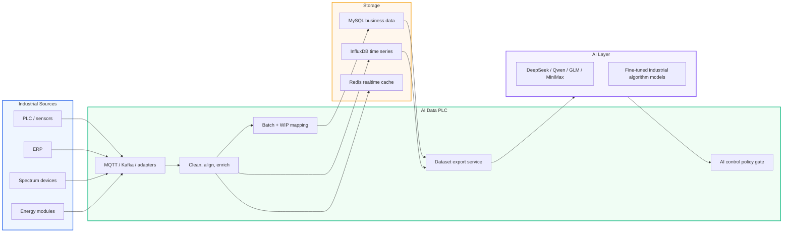
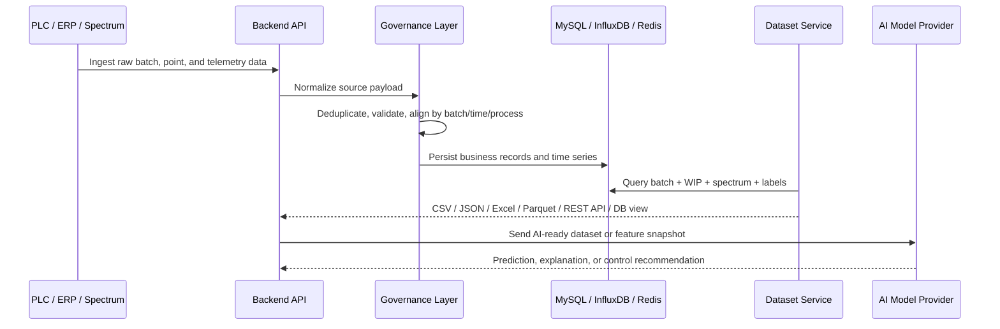
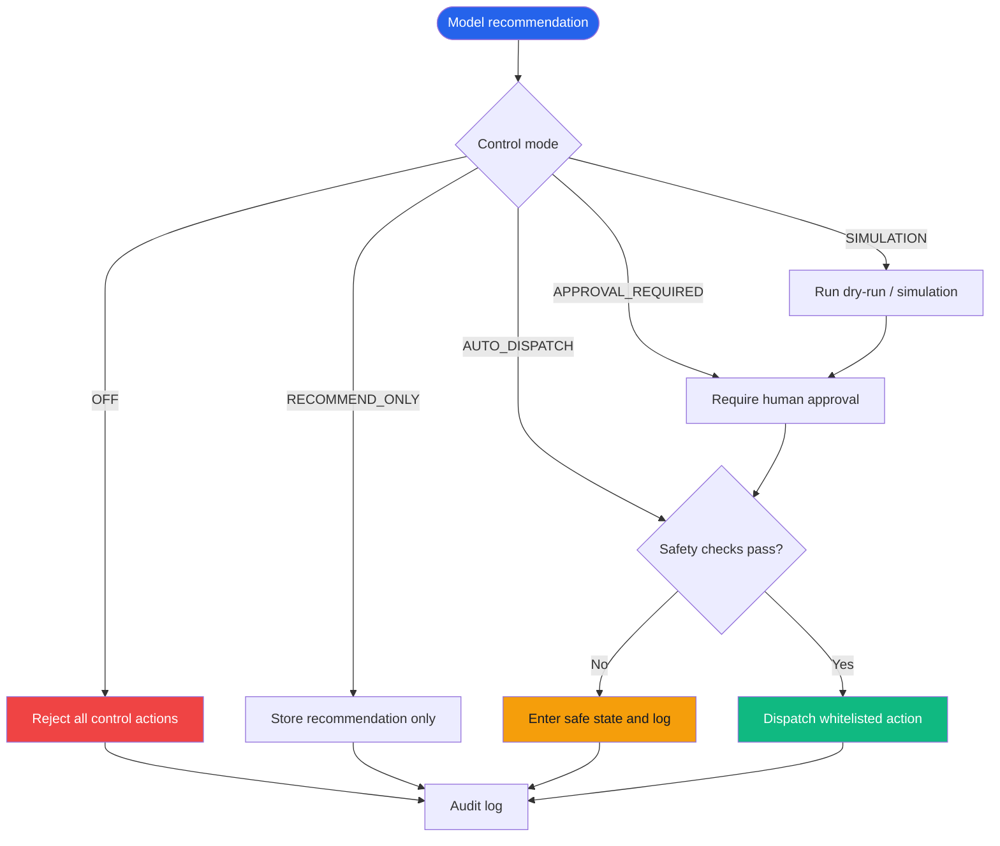
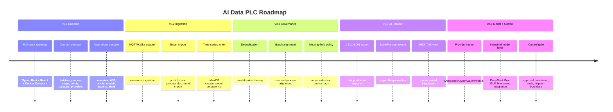

<h1 align="center">AI Data PLC</h1>

<p align="center">
  <strong>Industrial Data Middleware for Textile Dyeing AI</strong><br/>
  Connect PLC, ERP, spectrum, energy, and process data into standardized datasets for industrial AI training, simulation, and control recommendations.
</p>

<p align="center">
  
  
  
  
  
  
  
  
</p>

---

## Overview

AI Data PLC is an industrial data middle platform for textile dyeing production. It sits between the device collection layer and the AI algorithm layer:

```text
PLC / ERP / spectrum / energy data
        -> AI Data PLC
        -> cleaning, alignment, WIP mapping, storage, export
        -> standardized datasets
        -> AI training, simulation, process analysis, and control recommendations
```

The first implementation focuses on dyeing-batch data where one vessel production run maps to one standardized `batch_id`. The platform is designed to turn raw industrial data into reusable, traceable, AI-ready data assets.

## Key Capabilities

- **Multi-source ingestion** - PLC, ERP, spectrum devices, energy modules, and future protocol adapters.
- **Dual protocol plan** - MQTT/Kafka standard ingestion first, with PLC direct adapters reserved for OPC UA, Modbus, S7, or customer-specific protocols.
- **Batch-centered data model** - `batch_id` anchors production batch, WIP events, process steps, device telemetry, spectrum results, and dataset export jobs.
- **Process/WIP mapping** - Maps textile dyeing steps such as open card, bucket assignment, cold pad-batch, dyeing, reduction cleaning, soaping, setting, drying, and finished rolling.
- **Data governance** - Deduplication, invalid-value filtering, missing-field repair hooks, batch/time/process alignment, and quality flags.
- **Layered storage** - MySQL for business data, InfluxDB for high-frequency time series, Redis for latest state and operational cache.
- **AI-ready dataset export** - CSV, JSON, Excel, Parquet, REST API, and database-view contracts.
- **Model provider management** - DeepSeek Pro, Qwen, GLM, MiniMax, and OpenAI-compatible providers are configurable from environment and the backend model contract.
- **Industrial algorithm layer** - DeepSeek Pro / GLM fine-tuned or served models can be used for dyeing result prediction, process optimization, and control recommendations.
- **AI control policy gate** - Control modes include off, recommendation only, simulation, approval required, and auto dispatch.
- **Operations console** - React management UI for overview, collection status, batch tracking, process flow, point catalog, model management, dataset export, and alerts.
- **Deployable from day one** - Docker Compose for local/staging and Render Blueprint scaffolding for cloud deployment.

## Quick Start

Copy the environment template, fill secrets when needed, then start the stack:

```bash
cp .env.example .env
docker compose up --build
```

| Service | URL |
| --- | --- |
| Frontend console | http://localhost:5173 |
| Backend API | http://localhost:8080 |
| Backend health | http://localhost:8080/actuator/health |
| MySQL | localhost:3306 |
| InfluxDB | http://localhost:8086 |
| Redis | localhost:6379 |

## Prerequisites

- Docker Desktop with Compose support
- Node.js 22+ for frontend-only development
- Java 21 and Maven are optional locally because the backend builds inside Docker

## Local Development

### Full Stack

```bash
docker compose up --build
```

### Frontend Only

```bash
cd frontend
npm install
npm run dev
```

### Backend Docker Build

```bash
docker build -t ai-data-plc-backend:dev ./backend
```

### Frontend Docker Build

```bash
docker build -t ai-data-plc-frontend:dev ./frontend
```

## Architecture

```text
AI_Data_PLC/
|-- backend/                  # Spring Boot 3.3 + Java 21 API service
|   |-- src/main/java/com/supergokou/aidataplc/
|   |   |-- config/           # Runtime config, CORS, model provider properties
|   |   |-- controller/       # REST controllers under /api/v1
|   |   |-- domain/           # Records and enums for platform contracts
|   |   |-- dto/              # Request/response DTOs
|   |   `-- service/          # Dataset, model provider, and sample data services
|   |-- src/main/resources/   # Spring configuration
|   `-- Dockerfile
|-- frontend/                 # React 18 + Vite 8 operations console
|   |-- src/
|   |   |-- App.tsx           # Current console shell and pages
|   |   |-- main.tsx
|   |   `-- styles.css
|   `-- Dockerfile
|-- deploy/
|   `-- mysql/init/           # Initial MySQL schema for local Compose
|-- docs/
|   |-- architecture.md       # System architecture notes
|   |-- data-mapping.md       # Spreadsheet-to-domain mapping
|   |-- deployment.md         # Local and Render deployment notes
|   `-- multi-agent-plan.md   # Agent execution plan
|-- docker-compose.yml        # MySQL + InfluxDB + Redis + backend + frontend
|-- render.yaml               # Render Blueprint scaffold
`-- .env.example              # Public template, no real secrets
```

## System Design

### High-Level Flow



### Dataset Pipeline



### AI Control Decision Gate



## API Endpoints

| Method | Path | Description |
| --- | --- | --- |
| `GET` | `/actuator/health` | Spring Boot health check |
| `GET` | `/api/v1/overview` | Dashboard overview metrics |
| `GET` | `/api/v1/batches` | Current sample production batches |
| `GET` | `/api/v1/process-steps` | Process/WIP mapping |
| `GET` | `/api/v1/points` | AI data collection point definitions |
| `GET` | `/api/v1/models/providers` | Model provider configuration status without exposing API keys |
| `GET` | `/api/v1/models/control-policy` | Current AI control mode and safety policy |
| `GET` | `/api/v1/datasets/formats` | Supported dataset export formats |
| `POST` | `/api/v1/datasets/exports` | Create a dataset export job |

Example export request:

```json
{
  "batchIds": ["B20260324001", "B20260324002"],
  "format": "CSV",
  "includeSpectrum": true,
  "includeWipEvents": true,
  "includeAiLabels": true
}
```

## Data Model

Initial local schema is defined in `deploy/mysql/init/001_initial_schema.sql`.

| Table | Purpose |
| --- | --- |
| `production_batch` | Batch-level production state anchored by `batch_id` |
| `process_step` | Standard route steps and process/WIP definitions |
| `batch_wip_event` | Batch movement through each process step |
| `point_definition` | Collection point catalog from the PLC project spreadsheet |
| `spectrum_result` | K/S, reflectance, Delta E 2000, Lab values, and spectrum JSON |
| `dataset_export_job` | Async dataset export lifecycle |
| `model_provider_config` | Model provider metadata and secret references |
| `ai_decision_log` | Model recommendation, approval, dispatch, and audit record |

## Supported Dataset Formats

| Format | Use Case |
| --- | --- |
| CSV | Simple offline model training and spreadsheet inspection |
| JSON | API integration and nested WIP/spectrum payloads |
| Excel | Business review and manual data exchange |
| Parquet | Large-scale training and analytics pipelines |
| REST API | Online AI service calls |
| DB view | BI, analytics, and controlled internal data access |

## Model Providers

| Provider | Role |
| --- | --- |
| DeepSeek Pro | Industrial algorithm layer, reasoning, prediction support |
| GLM | Industrial algorithm layer, fine-tuned or served model backend |
| Qwen | LLM analysis, reporting, and optional algorithm provider |
| MiniMax | LLM analysis, reporting, and operator assistance |
| OpenAI-compatible | Any compatible gateway, local model service, vLLM, or future provider |

Provider secrets are read from environment variables. The backend only exposes configuration status and model names, never raw API keys.

## AI Control Modes

| Mode | Behavior |
| --- | --- |
| `OFF` | Disable all AI control behavior |
| `RECOMMEND_ONLY` | Store suggestions, no device-facing action |
| `SIMULATION` | Run dry-run decisions without dispatch |
| `APPROVAL_REQUIRED` | Human approval required before dispatch |
| `AUTO_DISPATCH` | Dispatch only after all safety gates pass |

Default mode is `RECOMMEND_ONLY`.

## Configuration

Key environment variables are documented in `.env.example`.

```env
PLC_REALTIME_DELAY_SECONDS=5
AI_CONTROL_MODE=RECOMMEND_ONLY

DEEPSEEK_API_KEY=
QWEN_API_KEY=
GLM_API_KEY=
MINIMAX_API_KEY=
OPENAI_COMPATIBLE_API_KEY=

AI_CONTROL_WRITE_ENABLED=false
AI_CONTROL_DRY_RUN=true
AI_CONTROL_REQUIRE_HUMAN_APPROVAL=true
AI_CONTROL_ALLOWED_ACTIONS=READ_STATUS,SUGGEST_SETPOINT
AI_CONTROL_BLOCKED_ACTIONS=PLC_WRITE,PUMP_START,VALVE_OPEN,RESET_ESTOP
```

Never commit a real `.env` file.

## Deployment

### Local / Staging

```bash
docker compose up -d --build
```

### Render

The repository includes `render.yaml` as a Blueprint scaffold.

Important deployment notes:

- Frontend `VITE_API_BASE_URL` must be the backend public URL.
- Backend `CORS_ALLOWED_ORIGINS` must include the frontend public URL.
- Real API keys and database passwords should be configured as Render secrets.
- Production MySQL, InfluxDB, and Redis can be external managed services.

## Quality Checks

The current baseline has been verified with:

```bash
npm run build
npm audit --registry=https://registry.npmjs.org
docker build -t ai-data-plc-backend:dev ./backend
docker build -t ai-data-plc-frontend:dev ./frontend
docker compose up -d --build
```

Expected health check:

```json
{
  "status": "UP"
}
```

## Current Limitations

- MQTT/Kafka and PLC direct protocol adapters are planned but not yet implemented.
- MySQL schema is currently an initialization script; production migrations should move to Flyway or Liquibase.
- Dataset export jobs currently expose the contract and queue response, not full file generation.
- The UI is a first operations-console baseline and uses sample backend data.
- AI provider calls and fine-tuning job orchestration are not yet wired to external APIs.

## Roadmap



## Documentation

- [Architecture](docs/architecture.md)
- [Data Mapping](docs/data-mapping.md)
- [Deployment](docs/deployment.md)
- [Multi-Agent Plan](docs/multi-agent-plan.md)

## Contributing

1. Create a feature branch.
2. Keep secrets out of the repository.
3. Add or update tests for backend contracts and frontend workflows.
4. Run local build checks before opening a pull request.
5. Document schema or environment changes in `docs/`.
