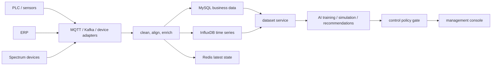

# Architecture

AI Data PLC is the middle layer between device collection and AI model usage.

## Backend Modules

- `controller`: REST endpoints for dashboard, metadata, model providers, and datasets.
- `service`: application services and provider routing.
- `domain`: typed records and enums shared by controllers and services.
- `config`: runtime configuration, loaded from environment variables.

## Storage Plan

- MySQL: production batches, process steps, WIP events, point definitions, export jobs, model provider settings, control policy and decision logs.
- InfluxDB: high-frequency temperature, pH, conductivity, flow, spectrum-derived values, equipment telemetry.
- Redis: latest point values, online/offline status, recent alerts, export job progress.

## AI Layers

1. LLM provider layer: DeepSeek, Qwen, GLM, MiniMax, and OpenAI-compatible providers for explanation, reporting, SOP Q&A, and operator recommendations.
2. Industrial algorithm layer: DeepSeek Pro / GLM fine-tuned or served models for process prediction, dyeing result prediction, parameter optimization, and control recommendations.

All control recommendations pass through the control policy gate before any device-facing action.

## API Versioning

Public application APIs use the `/api/v1` prefix. Actuator health endpoints remain under `/actuator`.
